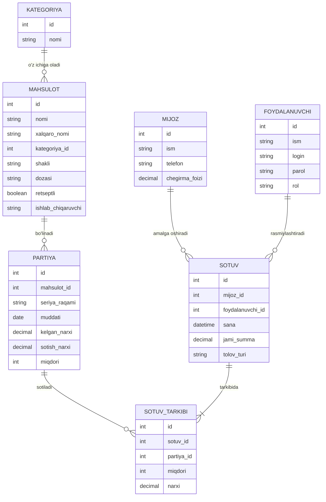

# Smart_dorixona
kichik dorixonani avtomallashtirish axborot tizimi
## Loyiha haqida
Ushbu loyiha kichik dorixona faoliyatini avtomatlashtirish uchun
axborot tizimini ishlab chiqishga mo'ljallangan.

## Loyiha maqsadi
Dorixonadagi mahsulotlar, sotuvlar, mijozlar va ombor
ma'lumotlarini elektron shaklda boshqarish.

## Tizim foydalanuvchilari
- Administrator
- Sotuvchi
- Omborchi

## Asosiy imkoniyatlar
- Mahsulot qo'shish
- Mahsulotni tahrirlash
- Mahsulotni o'chirish
- Mahsulotlarni qidirish
- Sotuvni amalga oshirish
- Ombordagi mahsulot qoldig'ini nazorat qilish
- Mijozlarni ro'yxatga olish
- Sotuvlar bo'yicha hisobot olish

## Ma'lumotlar bazasi
Loyihada quyidagi asosiy jadvallar yaratiladi:
- Kategoriyalar
- Mahsulotlar
- Mijozlar
- Sotuvlar
- Sotuv tarkibi
- Foydalanuvchilar

## Loyiha holati
🟡 Ishlab chiqilmoqda
---

## Mantiqiy model (Batafsil)

### 1. Kategoriya
Dori vositalari va tibbiy buyumlarni guruhlarga ajratish uchun ishlatiladi.
- `id`
- `nomi`

### 2. Mahsulot (Dori vositasi)
Dorixonada sotiladigan dori-darmonlar haqida umumiy ma'lumotlarni saqlaydi.
- `id`
- `nomi`
- `xalqaro_nomi`
- `kategoriya_id`
- `shakli`
- `dozasi`
- `retseptli`
- `ishlab_chiqaruvchi`

### 3. Partiya (Ombor qoldig'i)
Bir xil dorining har xil seriyali va yaroqlilik muddatli partiyalarini saqlaydi.
- `id`
- `mahsulot_id`
- `seriya_raqami`
- `muddati`
- `kelgan_narxi`
- `sotish_narxi`
- `miqdori`

### 4. Mijoz
- `id`
- `ism`
- `telefon`
- `chegirma_foizi`

### 5. Sotuv
- `id`
- `mijoz_id`
- `foydalanuvchi_id`
- `sana`
- `jami_summa`
- `to'lov_turi`

### 6. Sotuv tarkibi
- `id`
- `sotuv_id`
- `partiya_id`
- `miqdori`
- `narxi`

### 7. Foydalanuvchi
- `id`
- `ism`
- `login`
- `parol`
- `rol`

---

## ER Diagramma

